# Society360 Platform - System Architecture & Flow Diagrams

**Project:** Society360 – Smart Residential Management System  
**Organization:** Civora Nexus Pvt. Ltd.  
**Document Type:** System Architecture Diagrams  
**Version:** 1.0  
**Date:** February 9, 2026

---

## Table of Contents

1. [System Architecture Overview](#1-system-architecture-overview)
2. [Database Entity-Relationship Diagram](#2-database-entity-relationship-diagram)
3. [Authentication Flow Diagram](#3-authentication-flow-diagram)
4. [Visitor Management Flow](#4-visitor-management-flow)
5. [Maintenance Request Flow](#5-maintenance-request-flow)
6. [Finance & Billing Flow](#6-finance--billing-flow)
7. [API Architecture](#7-api-architecture)
8. [Component Architecture](#8-component-architecture)
9. [User Role Hierarchy](#9-user-role-hierarchy)
10. [Deployment Architecture](#10-deployment-architecture)
11. [Security Architecture](#11-security-architecture)
12. [Data Flow Diagram](#12-data-flow-diagram)

---

## 1. System Architecture Overview

### Three-Tier Architecture

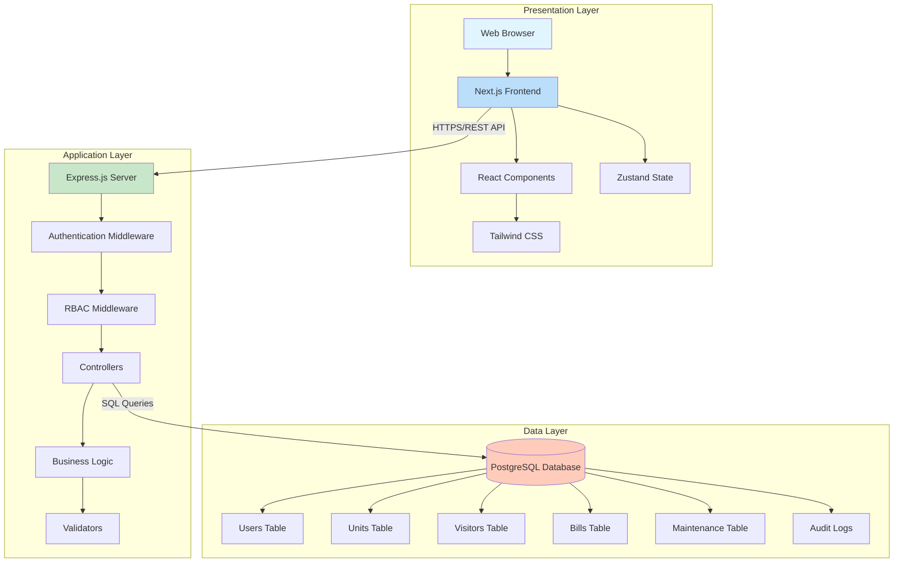
```mermaid
graph TB
    subgraph "Presentation Layer"
        A[Web Browser]
        B[Next.js Frontend]
        C[React Components]
        D[Tailwind CSS]
        E[Zustand State]
    end
    
    subgraph "Application Layer"
        F[Express.js Server]
        G[Authentication Middleware]
        H[RBAC Middleware]
        I[Controllers]
        J[Business Logic]
        K[Validators]
    end
    
    subgraph "Data Layer"
        L[(PostgreSQL Database)]
        M[Users Table]
        N[Units Table]
        O[Visitors Table]
        P[Bills Table]
        Q[Maintenance Table]
        R[Audit Logs]
    end
    
    A --> B
    B --> C
    C --> D
    B --> E
    
    B -->|HTTPS/REST API| F
    F --> G
    G --> H
    H --> I
    I --> J
    J --> K
    
    I -->|SQL Queries| L
    L --> M
    L --> N
    L --> O
    L --> P
    L --> Q
    L --> R
    
    style A fill:#e1f5ff
    style B fill:#bbdefb
    style F fill:#c8e6c9
    style L fill:#ffccbc
```

### High-Level System Flow

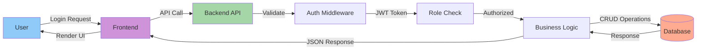
```mermaid
flowchart LR
    A[User] -->|Login Request| B[Frontend]
    B -->|API Call| C[Backend API]
    C -->|Validate| D[Auth Middleware]
    D -->|JWT Token| E[Role Check]
    E -->|Authorized| F[Business Logic]
    F -->|CRUD Operations| G[(Database)]
    G -->|Response| F
    F -->|JSON Response| B
    B -->|Render UI| A
    
    style A fill:#90caf9
    style B fill:#ce93d8
    style C fill:#a5d6a7
    style G fill:#ffab91
```

---

## 2. Database Entity-Relationship Diagram

### Complete ER Diagram

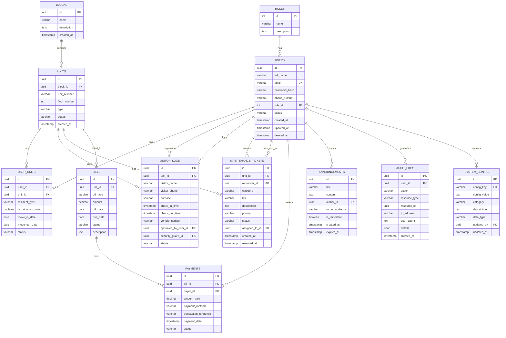
```mermaid
erDiagram
    ROLES ||--o{ USERS : has
    USERS ||--o{ USER_UNITS : has
    UNITS ||--o{ USER_UNITS : has
    BLOCKS ||--o{ UNITS : contains
    USERS ||--o{ VISITOR_LOGS : approves
    USERS ||--o{ VISITOR_LOGS : logs
    UNITS ||--o{ VISITOR_LOGS : visits
    UNITS ||--o{ MAINTENANCE_TICKETS : has
    USERS ||--o{ MAINTENANCE_TICKETS : creates
    USERS ||--o{ MAINTENANCE_TICKETS : assigned_to
    UNITS ||--o{ BILLS : billed_to
    BILLS ||--o{ PAYMENTS : has
    USERS ||--o{ PAYMENTS : makes
    USERS ||--o{ ANNOUNCEMENTS : creates
    USERS ||--o{ AUDIT_LOGS : generates
    USERS ||--o{ SYSTEM_CONFIG : updates

    ROLES {
        int id PK
        varchar name
        text description
    }
    
    USERS {
        uuid id PK
        varchar full_name
        varchar email UK
        varchar password_hash
        varchar phone_number
        int role_id FK
        varchar status
        timestamp created_at
        timestamp updated_at
        timestamp deleted_at
    }
    
    BLOCKS {
        uuid id PK
        varchar name
        text description
        timestamp created_at
    }
    
    UNITS {
        uuid id PK
        uuid block_id FK
        varchar unit_number
        int floor_number
        varchar type
        varchar status
        timestamp created_at
    }
    
    USER_UNITS {
        uuid id PK
        uuid user_id FK
        uuid unit_id FK
        varchar resident_type
        boolean is_primary_contact
        date move_in_date
        date move_out_date
        varchar status
    }
    
    VISITOR_LOGS {
        uuid id PK
        uuid unit_id FK
        varchar visitor_name
        varchar visitor_phone
        varchar purpose
        timestamp check_in_time
        timestamp check_out_time
        varchar vehicle_number
        uuid approved_by_user_id FK
        uuid security_guard_id FK
        varchar status
    }
    
    MAINTENANCE_TICKETS {
        uuid id PK
        uuid unit_id FK
        uuid requester_id FK
        varchar category
        varchar title
        text description
        varchar priority
        varchar status
        uuid assigned_to_id FK
        timestamp created_at
        timestamp resolved_at
    }
    
    BILLS {
        uuid id PK
        uuid unit_id FK
        varchar bill_type
        decimal amount
        date bill_date
        date due_date
        varchar status
        text description
    }
    
    PAYMENTS {
        uuid id PK
        uuid bill_id FK
        uuid payer_id FK
        decimal amount_paid
        varchar payment_method
        varchar transaction_reference
        timestamp payment_date
        varchar status
    }
    
    ANNOUNCEMENTS {
        uuid id PK
        varchar title
        text content
        uuid author_id FK
        varchar target_audience
        boolean is_important
        timestamp created_at
        timestamp expires_at
    }
    
    AUDIT_LOGS {
        uuid id PK
        uuid user_id FK
        varchar action
        varchar resource_type
        uuid resource_id
        varchar ip_address
        text user_agent
        jsonb details
        timestamp created_at
    }
    
    SYSTEM_CONFIG {
        uuid id PK
        varchar config_key UK
        text config_value
        varchar category
        text description
        varchar data_type
        uuid updated_by FK
        timestamp updated_at
    }
```

### Simplified Core Relationships

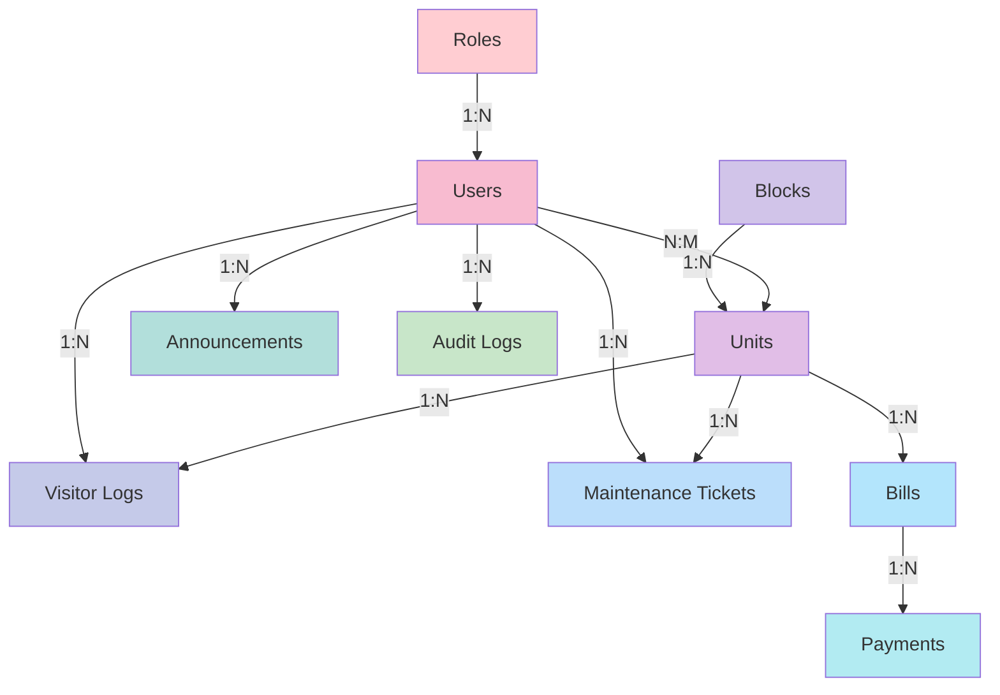
```mermaid
graph TD
    A[Roles] -->|1:N| B[Users]
    B -->|N:M| C[Units]
    D[Blocks] -->|1:N| C
    C -->|1:N| E[Visitor Logs]
    C -->|1:N| F[Maintenance Tickets]
    C -->|1:N| G[Bills]
    G -->|1:N| H[Payments]
    B -->|1:N| E
    B -->|1:N| F
    B -->|1:N| I[Announcements]
    B -->|1:N| J[Audit Logs]
    
    style A fill:#ffcdd2
    style B fill:#f8bbd0
    style C fill:#e1bee7
    style D fill:#d1c4e9
    style E fill:#c5cae9
    style F fill:#bbdefb
    style G fill:#b3e5fc
    style H fill:#b2ebf2
    style I fill:#b2dfdb
    style J fill:#c8e6c9
```

---

## 3. Authentication Flow Diagram

### Login Flow

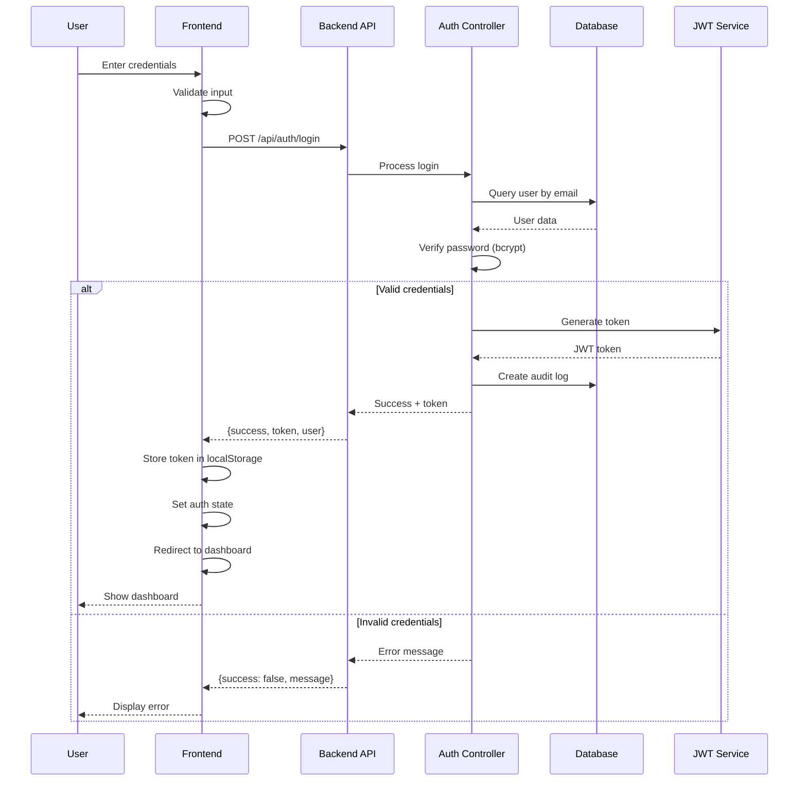
```mermaid
sequenceDiagram
    participant U as User
    participant F as Frontend
    participant API as Backend API
    participant Auth as Auth Controller
    participant DB as Database
    participant JWT as JWT Service
    
    U->>F: Enter credentials
    F->>F: Validate input
    F->>API: POST /api/auth/login
    API->>Auth: Process login
    Auth->>DB: Query user by email
    DB-->>Auth: User data
    Auth->>Auth: Verify password (bcrypt)
    
    alt Valid credentials
        Auth->>JWT: Generate token
        JWT-->>Auth: JWT token
        Auth->>DB: Create audit log
        Auth-->>API: Success + token
        API-->>F: {success, token, user}
        F->>F: Store token in localStorage
        F->>F: Set auth state
        F->>F: Redirect to dashboard
        F-->>U: Show dashboard
    else Invalid credentials
        Auth-->>API: Error message
        API-->>F: {success: false, message}
        F-->>U: Display error
    end
```

### Registration Flow

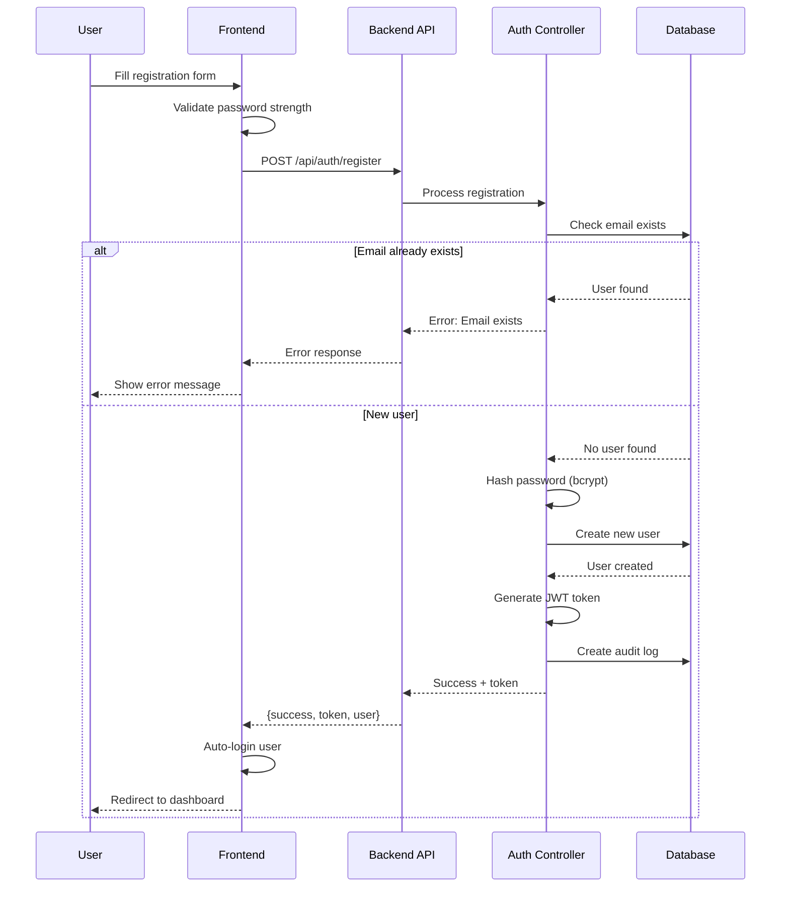
```mermaid
sequenceDiagram
    participant U as User
    participant F as Frontend
    participant API as Backend API
    participant Auth as Auth Controller
    participant DB as Database
    
    U->>F: Fill registration form
    F->>F: Validate password strength
    F->>API: POST /api/auth/register
    API->>Auth: Process registration
    Auth->>DB: Check email exists
    
    alt Email already exists
        DB-->>Auth: User found
        Auth-->>API: Error: Email exists
        API-->>F: Error response
        F-->>U: Show error message
    else New user
        DB-->>Auth: No user found
        Auth->>Auth: Hash password (bcrypt)
        Auth->>DB: Create new user
        DB-->>Auth: User created
        Auth->>Auth: Generate JWT token
        Auth->>DB: Create audit log
        Auth-->>API: Success + token
        API-->>F: {success, token, user}
        F->>F: Auto-login user
        F-->>U: Redirect to dashboard
    end
```

### Token Validation Flow

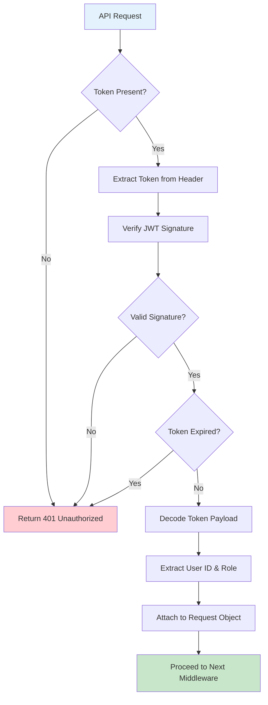
```mermaid
flowchart TD
    A[API Request] --> B{Token Present?}
    B -->|No| C[Return 401 Unauthorized]
    B -->|Yes| D[Extract Token from Header]
    D --> E[Verify JWT Signature]
    E --> F{Valid Signature?}
    F -->|No| C
    F -->|Yes| G{Token Expired?}
    G -->|Yes| C
    G -->|No| H[Decode Token Payload]
    H --> I[Extract User ID & Role]
    I --> J[Attach to Request Object]
    J --> K[Proceed to Next Middleware]
    
    style A fill:#e3f2fd
    style C fill:#ffcdd2
    style K fill:#c8e6c9
```

---

## 4. Visitor Management Flow

### Pre-Approval Process

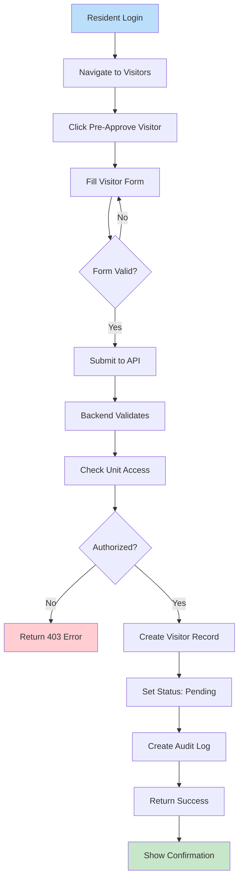
```mermaid
flowchart TD
    A[Resident Login] --> B[Navigate to Visitors]
    B --> C[Click Pre-Approve Visitor]
    C --> D[Fill Visitor Form]
    D --> E{Form Valid?}
    E -->|No| D
    E -->|Yes| F[Submit to API]
    F --> G[Backend Validates]
    G --> H[Check Unit Access]
    H --> I{Authorized?}
    I -->|No| J[Return 403 Error]
    I -->|Yes| K[Create Visitor Record]
    K --> L[Set Status: Pending]
    L --> M[Create Audit Log]
    M --> N[Return Success]
    N --> O[Show Confirmation]
    
    style A fill:#bbdefb
    style J fill:#ffcdd2
    style O fill:#c8e6c9
```

### Entry/Exit Logging Flow

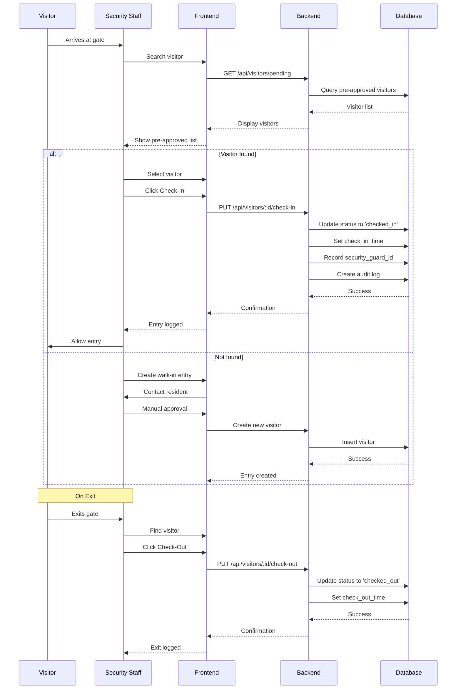
```mermaid
sequenceDiagram
    participant V as Visitor
    participant S as Security Staff
    participant F as Frontend
    participant API as Backend
    participant DB as Database
    
    V->>S: Arrives at gate
    S->>F: Search visitor
    F->>API: GET /api/visitors/pending
    API->>DB: Query pre-approved visitors
    DB-->>API: Visitor list
    API-->>F: Display visitors
    F-->>S: Show pre-approved list
    
    alt Visitor found
        S->>F: Select visitor
        S->>F: Click Check-In
        F->>API: PUT /api/visitors/:id/check-in
        API->>DB: Update status to 'checked_in'
        API->>DB: Set check_in_time
        API->>DB: Record security_guard_id
        API->>DB: Create audit log
        DB-->>API: Success
        API-->>F: Confirmation
        F-->>S: Entry logged
        S->>V: Allow entry
    else Not found
        S->>F: Create walk-in entry
        F->>S: Contact resident
        S->>F: Manual approval
        F->>API: Create new visitor
        API->>DB: Insert visitor
        DB-->>API: Success
        API-->>F: Entry created
    end
    
    Note over V,S: On Exit
    V->>S: Exits gate
    S->>F: Find visitor
    S->>F: Click Check-Out
    F->>API: PUT /api/visitors/:id/check-out
    API->>DB: Update status to 'checked_out'
    API->>DB: Set check_out_time
    DB-->>API: Success
    API-->>F: Confirmation
    F-->>S: Exit logged
```

### Visitor Status State Machine

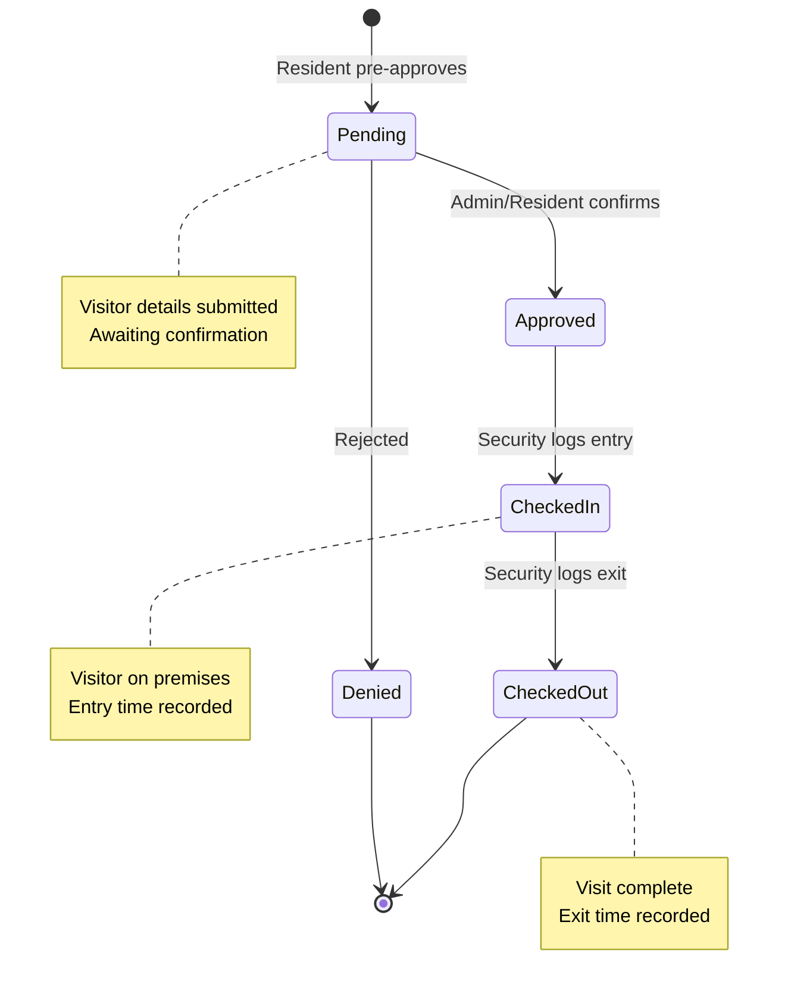
```mermaid
stateDiagram-v2
    [*] --> Pending: Resident pre-approves
    Pending --> Approved: Admin/Resident confirms
    Pending --> Denied: Rejected
    Approved --> CheckedIn: Security logs entry
    CheckedIn --> CheckedOut: Security logs exit
    CheckedOut --> [*]
    Denied --> [*]
    
    note right of Pending
        Visitor details submitted
        Awaiting confirmation
    end note
    
    note right of CheckedIn
        Visitor on premises
        Entry time recorded
    end note
    
    note right of CheckedOut
        Visit complete
        Exit time recorded
    end note
```

---

## 5. Maintenance Request Flow

### Complete Maintenance Lifecycle

```mermaid
flowchart TD
    A[Resident Dashboard] --> B[Submit Maintenance Request]
    B --> C[Fill Request Form]
    C --> D[Select Category]
    D --> E[Set Priority]
    E --> F[Add Description]
    F --> G[Submit Request]
    G --> H[API: Create Ticket]
    H --> I[DB: Store with Status 'Open']
    I --> J[Create Audit Log]
    
    J --> K[Admin Dashboard]
    K --> L[View Pending Requests]
    L --> M[Select Request]
    M --> N[Assign to Staff]
    N --> O[API: Update Assignment]
    O --> P[DB: Set assigned_to_id]
    P --> Q[Status: In Progress]
    
    Q --> R[Staff Dashboard]
    R --> S[View Assigned Tasks]
    S --> T[Work on Issue]
    T --> U[Update Progress]
    U --> V[Mark as Resolved]
    V --> W[API: Update Status]
    W --> X[DB: Set Status 'Resolved']
    X --> Y[Record resolved_at timestamp]
    
    Y --> Z{Resident Satisfied?}
    Z -->|Yes| AA[Close Ticket]
    Z -->|No| T
    AA --> AB[Final Status: Closed]
    AB --> AC[Complete Audit Trail]
    
    style A fill:#e3f2fd
    style I fill:#fff9c4
    style Q fill:#ffe0b2
    style X fill:#c8e6c9
    style AB fill:#b2dfdb
```

### Maintenance Status Sequence

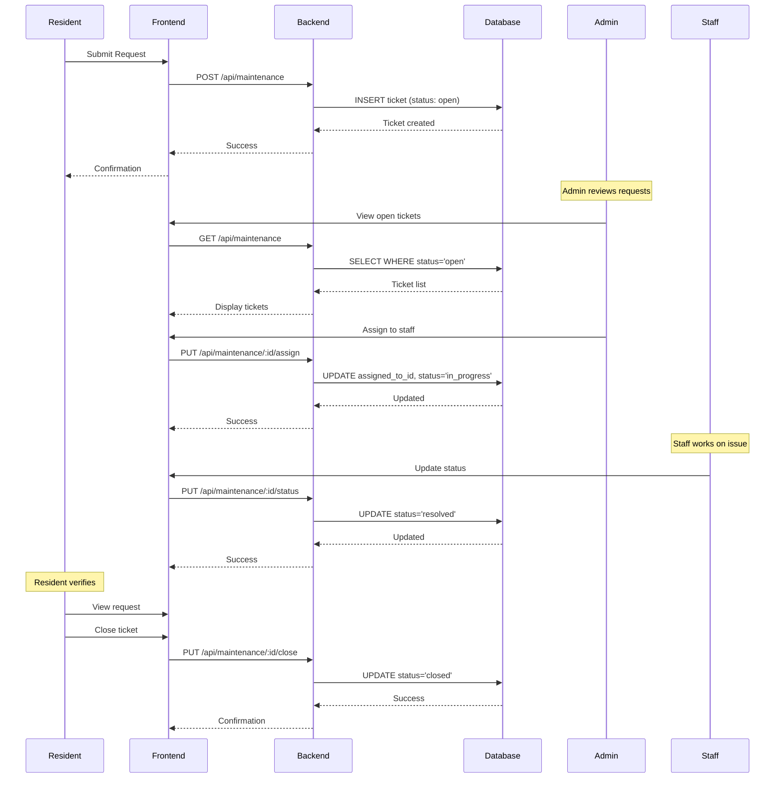
```mermaid
sequenceDiagram
    participant R as Resident
    participant F as Frontend
    participant API as Backend
    participant DB as Database
    participant A as Admin
    participant S as Staff
    
    R->>F: Submit Request
    F->>API: POST /api/maintenance
    API->>DB: INSERT ticket (status: open)
    DB-->>API: Ticket created
    API-->>F: Success
    F-->>R: Confirmation
    
    Note over A: Admin reviews requests
    A->>F: View open tickets
    F->>API: GET /api/maintenance
    API->>DB: SELECT WHERE status='open'
    DB-->>API: Ticket list
    API-->>F: Display tickets
    
    A->>F: Assign to staff
    F->>API: PUT /api/maintenance/:id/assign
    API->>DB: UPDATE assigned_to_id, status='in_progress'
    DB-->>API: Updated
    API-->>F: Success
    
    Note over S: Staff works on issue
    S->>F: Update status
    F->>API: PUT /api/maintenance/:id/status
    API->>DB: UPDATE status='resolved'
    DB-->>API: Updated
    API-->>F: Success
    
    Note over R: Resident verifies
    R->>F: View request
    R->>F: Close ticket
    F->>API: PUT /api/maintenance/:id/close
    API->>DB: UPDATE status='closed'
    DB-->>API: Success
    API-->>F: Confirmation
```

### Priority & Category Matrix

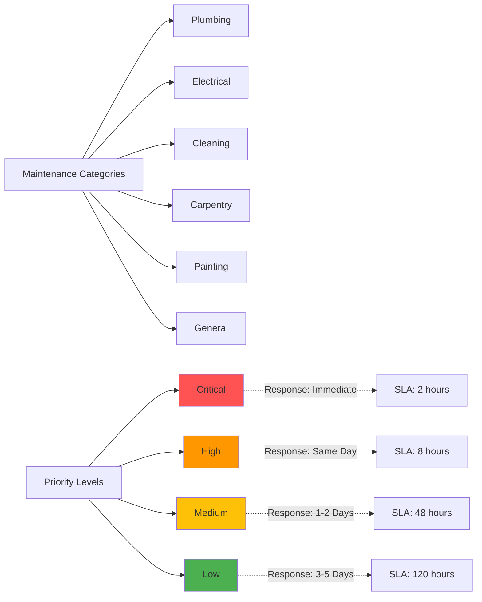
```mermaid
graph LR
    A[Maintenance Categories] --> B[Plumbing]
    A --> C[Electrical]
    A --> D[Cleaning]
    A --> E[Carpentry]
    A --> F[Painting]
    A --> G[General]
    
    H[Priority Levels] --> I[Critical]
    H --> J[High]
    H --> K[Medium]
    H --> L[Low]
    
    I -.->|Response: Immediate| M[SLA: 2 hours]
    J -.->|Response: Same Day| N[SLA: 8 hours]
    K -.->|Response: 1-2 Days| O[SLA: 48 hours]
    L -.->|Response: 3-5 Days| P[SLA: 120 hours]
    
    style I fill:#ff5252
    style J fill:#ff9800
    style K fill:#ffc107
    style L fill:#4caf50
```

---

## 6. Finance & Billing Flow

### Bill Generation to Payment Flow

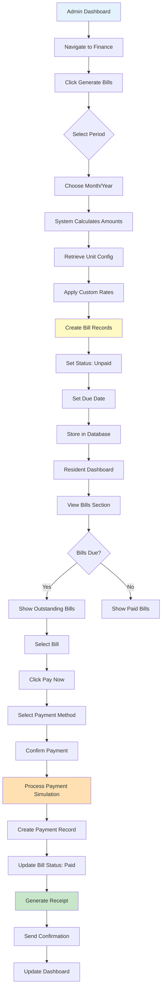
```mermaid
flowchart TD
    A[Admin Dashboard] --> B[Navigate to Finance]
    B --> C[Click Generate Bills]
    C --> D{Select Period}
    D --> E[Choose Month/Year]
    E --> F[System Calculates Amounts]
    F --> G[Retrieve Unit Config]
    G --> H[Apply Custom Rates]
    H --> I[Create Bill Records]
    I --> J[Set Status: Unpaid]
    J --> K[Set Due Date]
    K --> L[Store in Database]
    
    L --> M[Resident Dashboard]
    M --> N[View Bills Section]
    N --> O{Bills Due?}
    O -->|Yes| P[Show Outstanding Bills]
    O -->|No| Q[Show Paid Bills]
    
    P --> R[Select Bill]
    R --> S[Click Pay Now]
    S --> T[Select Payment Method]
    T --> U[Confirm Payment]
    U --> V[Process Payment Simulation]
    V --> W[Create Payment Record]
    W --> X[Update Bill Status: Paid]
    X --> Y[Generate Receipt]
    Y --> Z[Send Confirmation]
    Z --> AA[Update Dashboard]
    
    style A fill:#e3f2fd
    style I fill:#fff9c4
    style V fill:#ffe0b2
    style Y fill:#c8e6c9
```

### Payment Processing Sequence

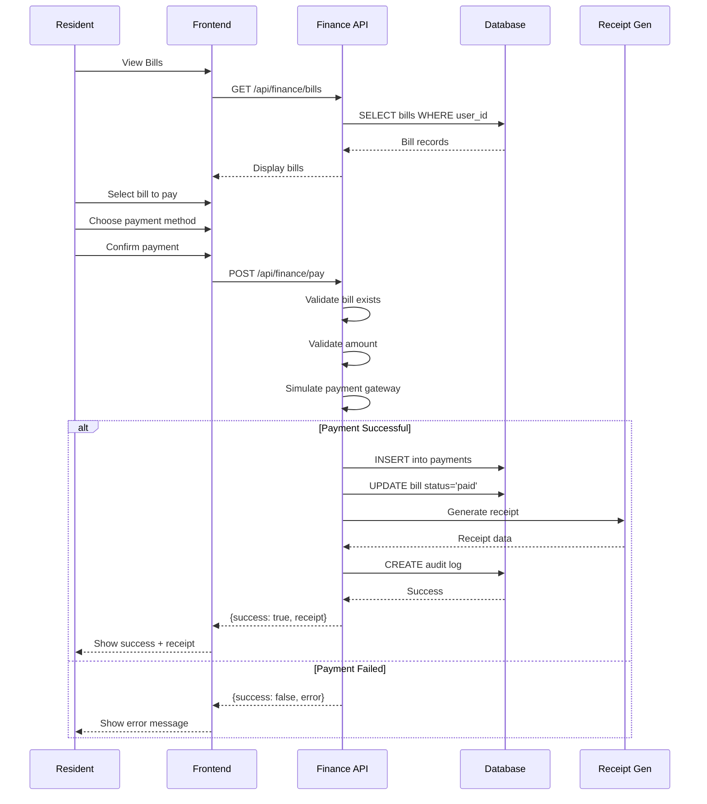
```mermaid
sequenceDiagram
    participant R as Resident
    participant F as Frontend
    participant API as Finance API
    participant DB as Database
    participant Receipt as Receipt Gen
    
    R->>F: View Bills
    F->>API: GET /api/finance/bills
    API->>DB: SELECT bills WHERE user_id
    DB-->>API: Bill records
    API-->>F: Display bills
    
    R->>F: Select bill to pay
    R->>F: Choose payment method
    R->>F: Confirm payment
    F->>API: POST /api/finance/pay
    API->>API: Validate bill exists
    API->>API: Validate amount
    API->>API: Simulate payment gateway
    
    alt Payment Successful
        API->>DB: INSERT into payments
        API->>DB: UPDATE bill status='paid'
        API->>Receipt: Generate receipt
        Receipt-->>API: Receipt data
        API->>DB: CREATE audit log
        DB-->>API: Success
        API-->>F: {success: true, receipt}
        F-->>R: Show success + receipt
    else Payment Failed
        API-->>F: {success: false, error}
        F-->>R: Show error message
    end
```

### Bill Status Lifecycle

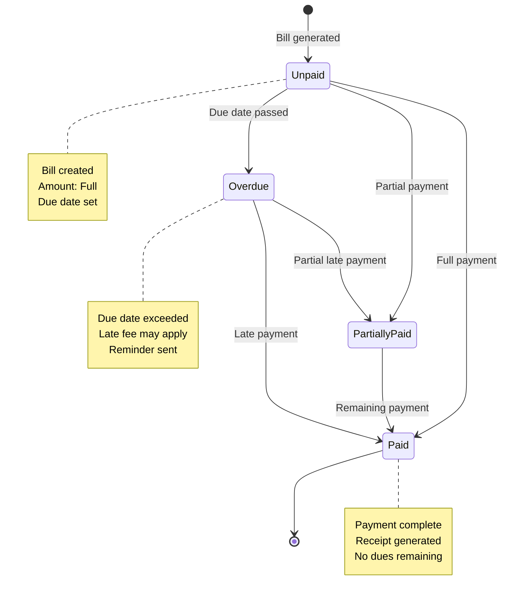
```mermaid
stateDiagram-v2
    [*] --> Unpaid: Bill generated
    Unpaid --> PartiallyPaid: Partial payment
    Unpaid --> Paid: Full payment
    PartiallyPaid --> Paid: Remaining payment
    Unpaid --> Overdue: Due date passed
    Overdue --> Paid: Late payment
    Overdue --> PartiallyPaid: Partial late payment
    Paid --> [*]
    
    note right of Unpaid
        Bill created
        Amount: Full
        Due date set
    end note
    
    note right of Overdue
        Due date exceeded
        Late fee may apply
        Reminder sent
    end note
    
    note right of Paid
        Payment complete
        Receipt generated
        No dues remaining
    end note
```

---

## 7. API Architecture

### RESTful API Structure

```mermaid
graph TD
    A[Society360 API] --> B[/api/auth]
    A --> C[/api/visitors]
    A --> D[/api/maintenance]
    A --> E[/api/finance]
    A --> F[/api/communication]
    A --> G[/api/units]
    A --> H[/api/admin]
    
    B --> B1[POST /login]
    B --> B2[POST /register]
    B --> B3[GET /me]
    B --> B4[POST /logout]
    
    C --> C1[POST /pre-approve]
    C --> C2[GET /pending]
    C --> C3[PUT /:id/check-in]
    C --> C4[PUT /:id/check-out]
    C --> C5[GET /history]
    
    D --> D1[POST /request]
    D --> D2[GET /tickets]
    D --> D3[PUT /:id/assign]
    D --> D4[PUT /:id/status]
    D --> D5[GET /:id]
    
    E --> E1[POST /bills/generate]
    E --> E2[GET /bills]
    E --> E3[POST /pay]
    E --> E4[GET /payments]
    E --> E5[GET /receipt/:id]
    
    F --> F1[POST /announcements]
    F --> F2[GET /announcements]
    F --> F3[DELETE /:id]
    
    G --> G1[GET /units]
    G --> G2[POST /units]
    G --> G3[PUT /:id]
    G --> G4[GET /my-unit]
    
    H --> H1[GET /users]
    H --> H2[POST /users]
    H --> H3[PUT /users/:id]
    H --> H4[GET /reports]
    H --> H5[GET /audit-logs]
    
    style A fill:#90caf9
    style B fill:#ce93d8
    style C fill:#a5d6a7
    style D fill:#ffab91
    style E fill:#fff59d
    style F fill:#ffccbc
    style G fill:#b2dfdb
    style H fill:#f48fb1
```

### API Request/Response Flow

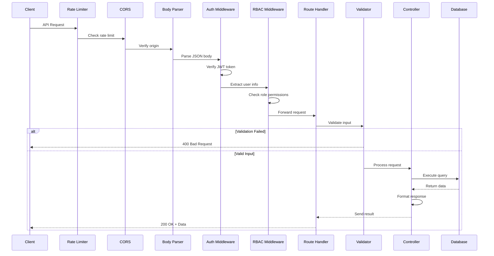
```mermaid
sequenceDiagram
    participant C as Client
    participant M1 as Rate Limiter
    participant M2 as CORS
    participant M3 as Body Parser
    participant M4 as Auth Middleware
    participant M5 as RBAC Middleware
    participant R as Route Handler
    participant V as Validator
    participant Ctrl as Controller
    participant DB as Database
    
    C->>M1: API Request
    M1->>M2: Check rate limit
    M2->>M3: Verify origin
    M3->>M4: Parse JSON body
    M4->>M4: Verify JWT token
    M4->>M5: Extract user info
    M5->>M5: Check role permissions
    M5->>R: Forward request
    R->>V: Validate input
    
    alt Validation Failed
        V-->>C: 400 Bad Request
    else Valid Input
        V->>Ctrl: Process request
        Ctrl->>DB: Execute query
        DB-->>Ctrl: Return data
        Ctrl->>Ctrl: Format response
        Ctrl-->>R: Send result
        R-->>C: 200 OK + Data
    end
```

### Middleware Chain

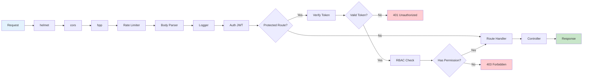
```mermaid
flowchart LR
    A[Request] --> B[helmet]
    B --> C[cors]
    C --> D[hpp]
    D --> E[Rate Limiter]
    E --> F[Body Parser]
    F --> G[Logger]
    G --> H[Auth JWT]
    H --> I{Protected Route?}
    I -->|No| J[Route Handler]
    I -->|Yes| K[Verify Token]
    K --> L{Valid Token?}
    L -->|No| M[401 Unauthorized]
    L -->|Yes| N[RBAC Check]
    N --> O{Has Permission?}
    O -->|No| P[403 Forbidden]
    O -->|Yes| J
    J --> Q[Controller]
    Q --> R[Response]
    
    style A fill:#e3f2fd
    style M fill:#ffcdd2
    style P fill:#ffcdd2
    style R fill:#c8e6c9
```

---

## 8. Component Architecture

### Frontend Component Hierarchy

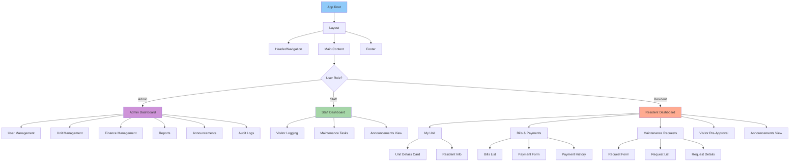
```mermaid
graph TD
    A[App Root] --> B[Layout]
    B --> C[Header/Navigation]
    B --> D[Main Content]
    B --> E[Footer]
    
    D --> F{User Role?}
    F -->|Admin| G[Admin Dashboard]
    F -->|Staff| H[Staff Dashboard]
    F -->|Resident| I[Resident Dashboard]
    
    G --> G1[User Management]
    G --> G2[Unit Management]
    G --> G3[Finance Management]
    G --> G4[Reports]
    G --> G5[Announcements]
    G --> G6[Audit Logs]
    
    H --> H1[Visitor Logging]
    H --> H2[Maintenance Tasks]
    H --> H3[Announcements View]
    
    I --> I1[My Unit]
    I --> I2[Bills & Payments]
    I --> I3[Maintenance Requests]
    I --> I4[Visitor Pre-Approval]
    I --> I5[Announcements View]
    
    I1 --> I1A[Unit Details Card]
    I1 --> I1B[Resident Info]
    
    I2 --> I2A[Bills List]
    I2 --> I2B[Payment Form]
    I2 --> I2C[Payment History]
    
    I3 --> I3A[Request Form]
    I3 --> I3B[Request List]
    I3 --> I3C[Request Details]
    
    style A fill:#90caf9
    style G fill:#ce93d8
    style H fill:#a5d6a7
    style I fill:#ffab91
```

### State Management Architecture

```mermaid
graph LR
    A[Global State - Zustand] --> B[Auth Store]
    A --> C[UI Store]
    A --> D[Data Store]
    
    B --> B1[User Info]
    B --> B2[Token]
    B --> B3[isAuthenticated]
    B --> B4[Login/Logout Methods]
    
    C --> C1[Loading States]
    C --> C2[Error Messages]
    C --> C3[Modal States]
    C --> C4[Toast Notifications]
    
    D --> D1[Visitors Cache]
    D --> D2[Maintenance Cache]
    D --> D3[Bills Cache]
    D --> D4[Announcements Cache]
    
    E[Component] --> F{Need Data?}
    F -->|Yes| G[useStore Hook]
    G --> A
    F -->|No| H[Local State]
    
    I[API Call] --> J{Success?}
    J -->|Yes| K[Update Store]
    K --> A
    J -->|No| L[Set Error State]
    L --> C
    
    style A fill:#ce93d8
    style B fill:#90caf9
    style C fill:#a5d6a7
    style D fill:#ffab91
```

---

## 9. User Role Hierarchy

### Role-Based Access Control

```mermaid
graph TD
    A[System Roles] --> B[Admin]
    A --> C[Staff]
    A --> D[Resident]
    
    B --> B1[Full System Access]
    B1 --> B2[User Management]
    B1 --> B3[Unit Management]
    B1 --> B4[Financial Reports]
    B1 --> B5[System Config]
    B1 --> B6[Audit Logs]
    B1 --> B7[All Announcements]
    
    C --> C1[Limited Access]
    C1 --> C2[Visitor Logging]
    C1 --> C3[Maintenance Updates]
    C1 --> C4[View Announcements]
    C1 --> C5[View Assigned Tasks]
    
    D --> D1[Personal Access]
    D1 --> D2[View Own Bills]
    D1 --> D3[Pay Bills]
    D1 --> D4[Submit Requests]
    D1 --> D5[Pre-Approve Visitors]
    D1 --> D6[View Own Unit]
    D1 --> D7[View Announcements]
    
    style B fill:#ff5252
    style C fill:#ff9800
    style D fill:#4caf50
```

### Permission Matrix

```mermaid
graph LR
    subgraph "Admin Permissions"
        A1[CREATE] --> AA[Users/Units/Bills/Config]
        A2[READ] --> AB[All Resources]
        A3[UPDATE] --> AC[Users/Units/Bills/System]
        A4[DELETE] --> AD[Users/Units/Records]
    end
    
    subgraph "Staff Permissions"
        S1[CREATE] --> SA[Visitor Logs]
        S2[READ] --> SB[Visitors/Maintenance]
        S3[UPDATE] --> SC[Maintenance Status/Visitor Status]
        S4[DELETE] --> SD[None]
    end
    
    subgraph "Resident Permissions"
        R1[CREATE] --> RA[Requests/Visitor Pre-Approval]
        R2[READ] --> RB[Own Bills/Requests/Unit]
        R3[UPDATE] --> RC[Own Profile]
        R4[DELETE] --> RD[None]
    end
    
    style A1 fill:#c8e6c9
    style S1 fill:#ffe0b2
    style R1 fill:#b3e5fc
```

---

## 10. Deployment Architecture

### Local Development Setup

```mermaid
graph TB
    subgraph "Development Machine"
        A[Developer Workstation]
        
        subgraph "Frontend"
            B[Next.js Dev Server]
            C[Port: 3000]
            D[Hot Reload]
        end
        
        subgraph "Backend"
            E[Express Server]
            F[Port: 5000]
            G[Nodemon Auto-restart]
        end
        
        subgraph "Database"
            H[PostgreSQL]
            I[Port: 5432]
            J[pgAdmin]
        end
        
        subgraph "Tools"
            K[VS Code]
            L[Git]
            M[Postman]
        end
    end
    
    A --> B
    A --> E
    A --> H
    A --> K
    
    B -->|API Calls| E
    E -->|SQL Queries| H
    
    K --> L
    K --> M
    M --> E
    J --> H
    
    style B fill:#90caf9
    style E fill:#a5d6a7
    style H fill:#ffab91
```

### Production Deployment Architecture (Proposed)

```mermaid
graph TB
    subgraph "Client Layer"
        A[Web Browser]
        B[Mobile Browser]
    end
    
    subgraph "CDN Layer"
        C[Vercel CDN]
        D[Static Assets]
        E[Edge Functions]
    end
    
    subgraph "Application Layer"
        F[Next.js Frontend]
        G[Node.js Backend]
        H[Load Balancer]
    end
    
    subgraph "Data Layer"
        I[(PostgreSQL Primary)]
        J[(PostgreSQL Replica)]
        K[Redis Cache]
    end
    
    subgraph "Services"
        L[File Storage - S3]
        M[Email Service]
        N[Monitoring]
    end
    
    A --> C
    B --> C
    C --> D
    C --> E
    E --> F
    
    F --> H
    H --> G
    
    G --> K
    K --> I
    I --> J
    
    G --> L
    G --> M
    
    F --> N
    G --> N
    I --> N
    
    style A fill:#e3f2fd
    style F fill:#90caf9
    style G fill:#a5d6a7
    style I fill:#ffab91
```

---

## 11. Security Architecture

### Multi-Layer Security Model

```mermaid
graph TD
    A[Security Layers] --> B[Application Security]
    A --> C[Network Security]
    A --> D[Data Security]
    A --> E[Authentication Security]
    
    B --> B1[Input Validation]
    B --> B2[Output Encoding]
    B --> B3[Error Handling]
    B --> B4[Rate Limiting]
    B --> B5[CORS Policy]
    
    C --> C1[HTTPS Only]
    C --> C2[Security Headers - Helmet]
    C --> C3[HPP Protection]
    C --> C4[XSS Prevention]
    
    D --> D1[Password Hashing - bcrypt]
    D --> D2[Encrypted Connections]
    D --> D3[Audit Logging]
    D --> D4[Data Sanitization]
    
    E --> E1[JWT Tokens]
    E --> E2[RBAC]
    E --> E3[Session Management]
    E --> E4[Token Expiry]
    
    style A fill:#ffcdd2
    style B fill:#f8bbd0
    style C fill:#e1bee7
    style D fill:#d1c4e9
    style E fill:#c5cae9
```

### Authentication Security Flow

```mermaid
sequenceDiagram
    participant U as User
    participant F as Frontend
    participant API as API Server
    participant JWT as JWT Service
    participant DB as Database
    
    Note over U,DB: Password Security
    U->>F: Enter password
    F->>F: Validate strength (client)
    F->>API: Send credentials (HTTPS)
    API->>API: Validate input (server)
    API->>DB: Query user
    DB-->>API: Hashed password
    API->>API: bcrypt.compare()
    
    alt Password Match
        API->>JWT: Generate token
        JWT->>JWT: Sign with secret
        JWT->>JWT: Set expiry (30d)
        JWT-->>API: Signed JWT
        API->>DB: Log successful login
        API-->>F: Token + User data
        F->>F: Store in localStorage
        F->>F: Set Authorization header
    else Password Mismatch
        API->>DB: Log failed attempt
        API-->>F: Invalid credentials
        F-->>U: Error message
    end
    
    Note over U,DB: Token Validation
    F->>API: API Request + Token
    API->>JWT: Verify token
    JWT->>JWT: Check signature
    JWT->>JWT: Check expiry
    
    alt Valid Token
        JWT-->>API: Decoded payload
        API->>API: Extract user info
        API->>API: Check permissions
        API-->>F: Authorized response
    else Invalid/Expired
        JWT-->>API: Validation failed
        API-->>F: 401 Unauthorized
        F->>F: Clear auth state
        F-->>U: Redirect to login
    end
```

### Data Protection Flow

```mermaid
flowchart LR
    A[User Input] --> B{Validate Type}
    B -->|Invalid| C[Reject - 400]
    B -->|Valid| D[Sanitize Input]
    D --> E[Remove HTML/Scripts]
    E --> F{Check SQL Injection}
    F -->|Suspicious| C
    F -->|Safe| G[Parameterized Query]
    G --> H[Execute on DB]
    H --> I[Retrieve Data]
    I --> J[Filter Sensitive Fields]
    J --> K{User Authorized?}
    K -->|No| L[Return Limited Data]
    K -->|Yes| M[Return Full Data]
    M --> N[Encode Output]
    N --> O[Log Access]
    O --> P[Send Response]
    
    style A fill:#e3f2fd
    style C fill:#ffcdd2
    style P fill:#c8e6c9
```

---

## 12. Data Flow Diagram

### Level 0 - Context Diagram

```mermaid
graph LR
    A[Resident] -->|Submit Requests| B[Society360 System]
    C[Admin] -->|Manage System| B
    D[Staff] -->|Update Status| B
    B -->|Bills & Receipts| A
    B -->|Reports| C
    B -->|Task Assignments| D
    B -->|Data Storage| E[(Database)]
    
    style B fill:#90caf9
    style E fill:#ffab91
```

### Level 1 - System Processes

```mermaid
flowchart TD
    subgraph "External Entities"
        A[Resident]
        B[Admin]
        C[Staff]
    end
    
    subgraph "Processes"
        D[1.0 Authentication]
        E[2.0 Visitor Management]
        F[3.0 Maintenance Management]
        G[4.0 Finance Management]
        H[5.0 Communication]
        I[6.0 Reporting]
    end
    
    subgraph "Data Stores"
        J[(Users DB)]
        K[(Visitors DB)]
        L[(Maintenance DB)]
        M[(Finance DB)]
        N[(Announcements DB)]
        O[(Audit Logs)]
    end
    
    A -->|Login| D
    B -->|Login| D
    C -->|Login| D
    
    D --> J
    
    A -->|Pre-approve| E
    C -->|Log Entry/Exit| E
    E --> K
    
    A -->|Submit Request| F
    B -->|Assign Task| F
    C -->|Update Status| F
    F --> L
    
    B -->|Generate Bills| G
    A -->|Make Payment| G
    G --> M
    
    B -->|Create Announcement| H
    H --> N
    
    B -->|View Reports| I
    I --> O
    
    style D fill:#bbdefb
    style E fill:#c5cae9
    style F fill:#c8e6c9
    style G fill:#fff9c4
    style H fill:#ffccbc
    style I fill:#f8bbd0
```

### Level 2 - Detailed Process Flow (Maintenance)

```mermaid
flowchart TD
    A[Resident] -->|Request Details| B[3.1 Receive Request]
    B --> C{Validate Input}
    C -->|Invalid| D[Return Error]
    C -->|Valid| E[3.2 Create Ticket]
    E --> F[(Maintenance DB)]
    F --> G[3.3 Notify Admin]
    
    H[Admin] --> I[3.4 Review Tickets]
    I --> F
    I --> J[3.5 Assign to Staff]
    J --> F
    J --> K[3.6 Notify Staff]
    
    L[Staff] --> M[3.7 View Assignment]
    M --> F
    M --> N[3.8 Update Progress]
    N --> F
    N --> O[3.9 Mark Resolved]
    O --> F
    O --> P[3.10 Notify Resident]
    
    P --> Q[Resident Verifies]
    Q --> R[3.11 Close Ticket]
    R --> F
    R --> S[(Audit Log)]
    
    style B fill:#e3f2fd
    style E fill:#bbdefb
    style J fill:#c8e6c9
    style O fill:#a5d6a7
    style R fill:#b2dfdb
```

### Complete System Data Flow

```mermaid
graph TB
    subgraph "User Actions"
        A1[Login/Register]
        A2[Submit Requests]
        A3[Pay Bills]
        A4[Pre-Approve Visitors]
        A5[View Data]
    end
    
    subgraph "API Layer"
        B1[Auth API]
        B2[Maintenance API]
        B3[Finance API]
        B4[Visitor API]
        B5[Query API]
    end
    
    subgraph "Business Logic"
        C1[Authenticate User]
        C2[Process Requests]
        C3[Calculate Bills]
        C4[Validate Visitors]
        C5[Generate Reports]
    end
    
    subgraph "Data Persistence"
        D1[(User Data)]
        D2[(Maintenance Data)]
        D3[(Financial Data)]
        D4[(Visitor Data)]
        D5[(System Logs)]
    end
    
    subgraph "Outputs"
        E1[Dashboard]
        E2[Receipts]
        E3[Reports]
        E4[Notifications]
    end
    
    A1 --> B1 --> C1 --> D1
    A2 --> B2 --> C2 --> D2
    A3 --> B3 --> C3 --> D3
    A4 --> B4 --> C4 --> D4
    A5 --> B5 --> C5
    
    C1 --> E1
    C3 --> E2
    C5 --> E3
    C2 --> E4
    
    D1 --> D5
    D2 --> D5
    D3 --> D5
    D4 --> D5
    
    style B1 fill:#90caf9
    style B2 fill:#ce93d8
    style B3 fill:#a5d6a7
    style B4 fill:#ffab91
    style B5 fill:#fff59d
```

---

## Conclusion

This document provides comprehensive visual representations of the Society360 platform's architecture and workflows. These diagrams illustrate:

- **System Architecture**: Three-tier separation with clear boundaries
- **Database Design**: Normalized structure with proper relationships
- **Authentication**: Secure JWT-based flow with role verification
- **Core Modules**: Detailed workflows for all major features
- **API Structure**: RESTful design with middleware chain
- **Security**: Multi-layer protection strategy
- **Data Flow**: Complete system process diagrams

These diagrams serve as technical documentation for understanding system design, troubleshooting issues, onboarding new developers, and planning future enhancements.

---

**Document Status:** ✅ Complete  
**Diagrams:** 35+ Mermaid Diagrams  
**Coverage:** All Major System Components  
**Last Updated:** February 9, 2026
